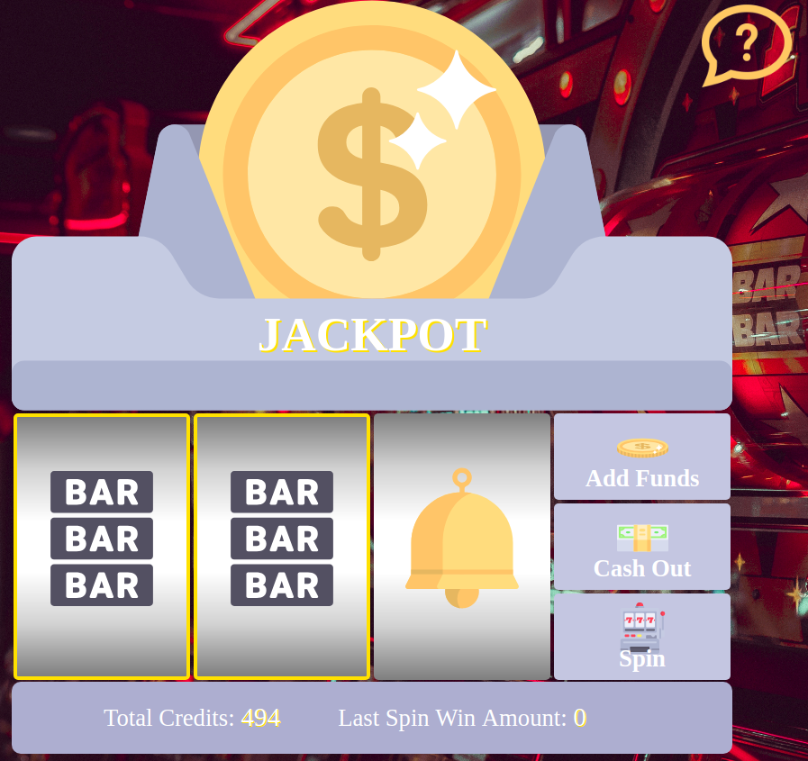

# Classic Slots
Classic Slots is a digital take on the classic slot machine. 

### Technologies Used:
* [HTML](https://developer.mozilla.org/en-US/docs/Web/HTML)
* [CSS](https://developer.mozilla.org/en-US/docs/Glossary/CSS) 
* [JavaScript](https://developer.mozilla.org/en-US/docs/Glossary/JavaScript) 

### Getting Started:

To play, visit: [Classic Slots](https://ladystensberg.github.io/slot-machine/)

### License:

This project is licensed under the [MIT License](https://opensource.org/licenses/MIT), &copy; 2018 Sarah Stensberg.

### Acknowledgments:

Icons made by [Freepik](http://www.freepik.com) from [Flaticon](http://www.flaticon.com) 

Background photo by [Carl Raw](https://unsplash.com/@carltraw)  from [Unsplash](http://www.unsplash.com) 

### Next Steps:

* Add Stripe API integration
* Add sound effects & animations
* Add more rows for diagonal spin wins